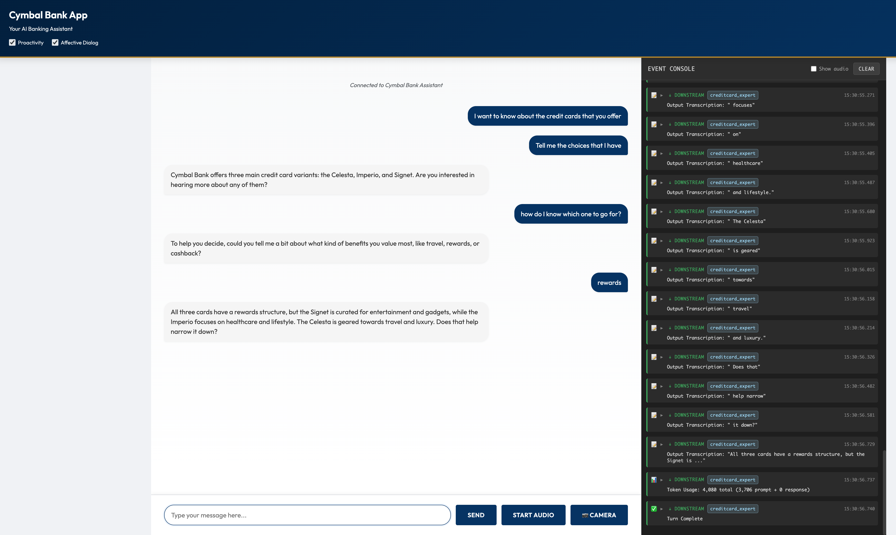

# Insurance Voice Agents

A multimodal voice assistant specialized in **LIC Life Insurance**. This application leverages **Google's Agent Development Kit (ADK)** and the **Gemini 2.5 Flash Native Audio** model to provide real-time, bidirectional voice interactions for insurance customers.



## Capabilities & Domain Delivery

### Domain: LIC Life Insurance
This agent serves as a customer support representative for Cymbal Insurance, specializing in **LIC (Life Insurance Corporation of India)** products. It is capable of:
-   **Multilingual Support**: Seamlessly switches between Hindi and English based on user preference.
-   **Product Expertise**: Providing detailed information about LIC plans (Endowment, Whole Life, Term Assurance, Pension).
-   **Eligibility Checks**: Verifying basic criteria (age, sum assured, policy term) for various plans.
-   **Proposal Initiation**: Collecting details for life insurance proposal forms (Form 300/340).

### Key Use Cases
1.  **Product Discovery**: "Tell me about the benefits of the Bima Jyoti plan."
2.  **Plan Comparison**: "What is the difference between Jeevan Azad and Jeevan Utsav?"
3.  **Annuity Inquiries**: "How does the Jeevan Dhara II pension plan work?"
4.  **Proposal**: "I want to apply for a term insurance policy." (Triggers the specialized proposal sub-agent).

## Agents Hierarchy

The system uses a hierarchical agent structure to manage conversation flow and expertise.

### 1. Main Agent: `insurancemaindesk`
-   **Role**: Primary customer entry point.
-   **Persona**: Female customer support assistant for Cymbal Insurance.
-   **Responsibilities**:
    -   Greeting customers.
    -   Handling general insurance inquiries.
    -   Routing specific product queries to the expert sub-agent.
-   **Tools**: Google Search.

### 2. Sub-Agent: `insuranceproduct_expert`
-   **Role**: Domain specialist for LIC Life Insurance.
-   **Responsibilities**:
    -   Answering detailed questions about plan features, bonuses, and tax benefits.
    -   Explaining eligibility criteria based on LIC guidelines.
    -   Handing off proposal intents to `fill_proposal`.
-   **Knowledge Base**: Comprehensive details on LIC Endowment, Whole Life, Term, and Pension plans.

### 3. Sub-Agent: `fill_proposal`
-   **Role**: Data collection specialist for proposal forms.
-   **Responsibilities**:
    -   Collecting applicant details (Name, Occupation, Sum Assured, etc.) in a structured format.
    -   Completing the proposal initiation process.

## Technical Aspects

-   **Framework**: [Google Agent Development Kit (ADK)](https://google.github.io/adk-docs/)
-   **AI Model**: Gemini 2.5 Flash Native Audio (Multimodal Live API).
    -   *Note*: Uses native audio capabilities for low-latency voice interaction.
-   **Backend**: Python 3.11, FastAPI, WebSocket.
-   **Frontend**: Vanilla HTML/JS/CSS (located in `app/static`).
-   **Communication**: Real-time WebSockets with binary audio streaming.
-   **Infrastructure**: Dockerized application deployable on Google Cloud Run.

## Deployment Guide

### Prerequisites
-   Python 3.10+
-   [uv](https://docs.astral.sh/uv/) (recommended) or pip
-   Google API Key (for Gemini Live API) or Google Cloud Project (for Vertex AI)

### 1. Local Setup

**Clone and Install Dependencies:**

```bash
# Using uv (Recommended)
uv sync

# Using pip
python3 -m venv .venv
source .venv/bin/activate
pip install -r requirements.txt # or install manually
```

**Configure Environment:**
Create an `app/.env` file:

```bash
GOOGLE_API_KEY=your_api_key_here
# Optional: Set model
DEMO_AGENT_MODEL=gemini-2.5-flash-native-audio-preview-12-2025
```

**Run the Server:**

```bash
cd app
# Using uv
uv run --project .. uvicorn main:app --reload --host 0.0.0.0 --port 8000

# Using pip
uvicorn main:app --reload --host 0.0.0.0 --port 8000
```
Access the UI at `http://localhost:8000`.

### 2. Docker Deployment

**Build the Image:**
```bash
docker build -t InsuranceVoiceAgents .
```

**Run Container:**
```bash
docker run -p 8080:8080 -e GOOGLE_API_KEY=your_key InsuranceVoiceAgents
```

### 3. Deploy to Google Cloud Run

1.  **Build and Push Image**:
    ```bash
    gcloud builds submit --tag gcr.io/YOUR_PROJECT_ID/InsuranceVoiceAgents
    ```

2.  **Deploy Service**:
    ```bash
    gcloud run deploy InsuranceVoiceAgents \
      --image gcr.io/YOUR_PROJECT_ID/InsuranceVoiceAgents \
      --platform managed \
      --region us-central1 \
      --allow-unauthenticated \
      --set-env-vars GOOGLE_API_KEY=your_key
    ```

## Live Environment

The application is deployed on Google Cloud Run:
- **Frontend URL**: `https://InsuranceVoiceAgents-frontend-2ewjgqzoja-uc.a.run.app`
- **Backend API URL**: `https://InsuranceVoiceAgents-2ewjgqzoja-uc.a.run.app`
